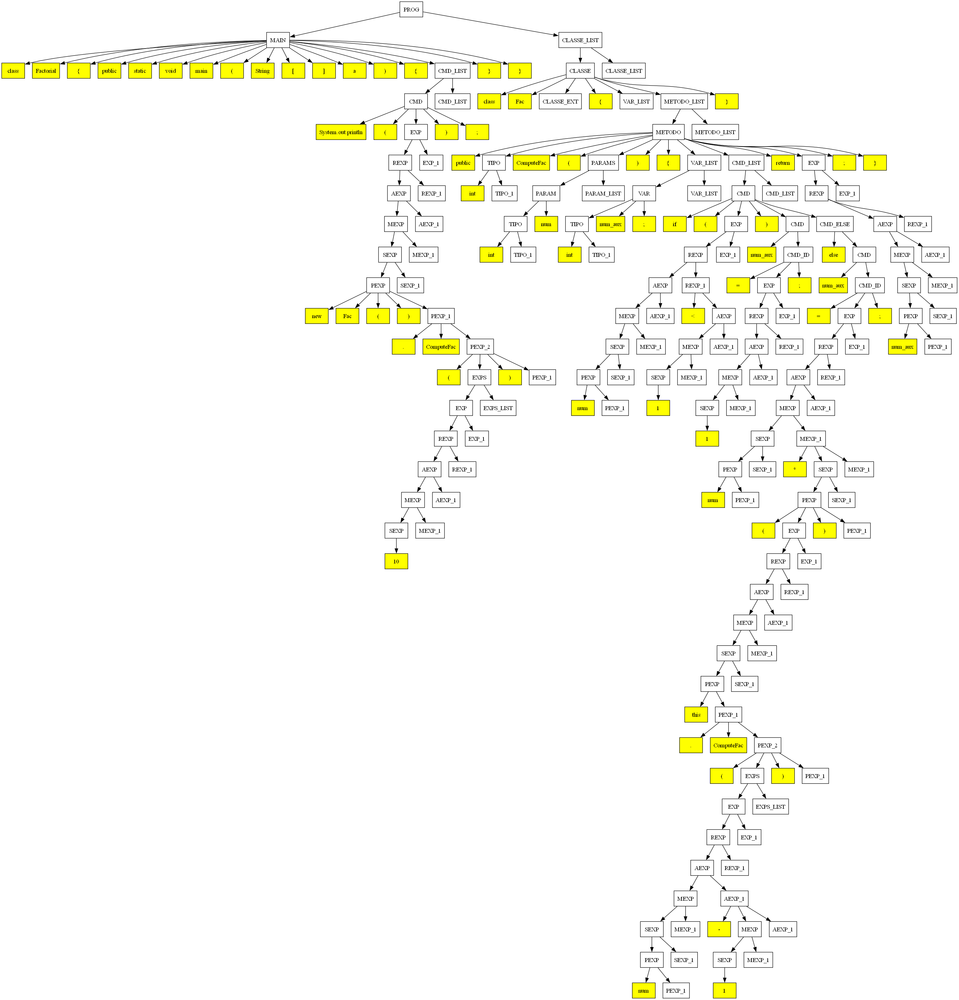
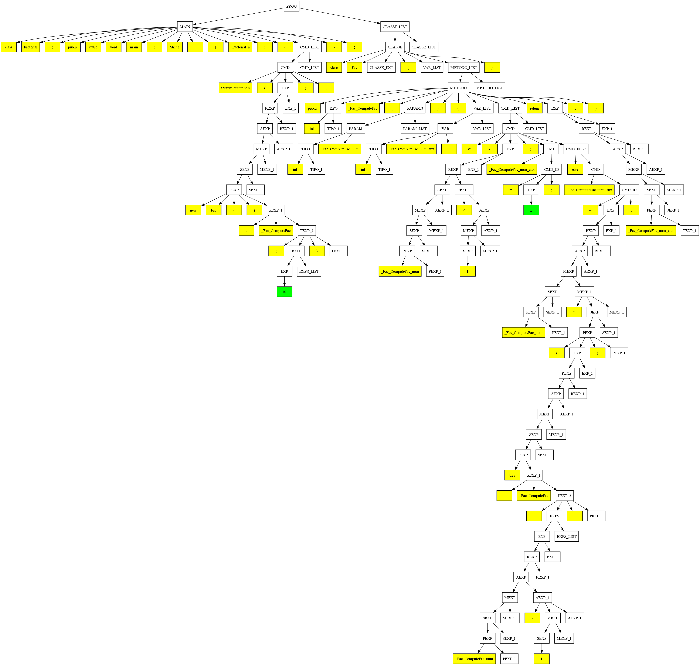

# Mini Java+ Compiler

This project currently implements only the Scanner to recognize the tokens and the Parser to build the AST

For the Parser we used a Recursive Descent approach, but we left factored the grammar in case we decided to use a Predictive approach using the First and Follow sets

## Setting up local environment:

```bash
# Check if pipenv is installed
$ pip show pipenv

# If not installed, install
$ pip install pipenv

# Install project dependencies
$ pipenv install

# Start pipenv virtual environment with installed dependencies to run the project
$ pipenv shell

# Run the code normally
$ python main.py
```

## Given EBNF:
```
PROG -> MAIN {CLASSE}
MAIN -> class id '{' public static void main '(' String '[' ']' id ')' '{' CMD '}' '}'
CLASSE -> class id [extends id] '{' {VAR} {METODO} '}'
VAR -> TIPO id ;
METODO -> public TIPO id '(' [PARAMS] ')' '{' {VAR} {CMD} return EXP ; '}'
PARAMS -> TIPO id {, TIPO id}
TIPO -> int '[' ']'
 | boolean
 | int
 | id
CMD -> '{' {CMD} '}'
 | if '(' EXP ')' CMD
 | if '(' EXP ')' CMD else CMD
 | while '(' EXP ')' CMD
 | System.out.println '(' EXP ')' ;
 | id = EXP ;
 | id '[' EXP ']' = EXP ;
EXP -> EXP && REXP
 | REXP
REXP -> REXP < AEXP
 | REXP == AEXP
 | REXP != AEXP
 | AEXP
AEXP -> AEXP + MEXP
 | AEXP - MEXP
 | MEXP
MEXP -> MEXP * SEXP
 | SEXP
SEXP -> ! SEXP
 | - SEXP
 | true
 | false
 | num
 | null
 | new int '[' EXP ']'
 | PEXP . length
 | PEXP '[' EXP ']'
 | PEXP
PEXP -> id
 | this
 | new id '(' ')'
 | '(' EXP ')'
 | PEXP . id
 | PEXP . id '(' [EXPS] ')'
EXPS -> EXP {, EXP}
```

## Treating the given grammar:

### Example of Ambiguity:

E -> E + E | E * E | (E) | id

### Removing Ambiguity:

E -> E + T | T

T -> T * F | F

F -> (E) | id

---

### Example of Left Recursion:

E -> E + T | T

T -> T * F | F

F -> (E) | id

### Removing Left Recursion:

E -> T E'

E' -> + T E' | ε

T -> F T'

T' -> * F T' | ε

F -> (E) | id

---

### Example of Non Left Factored:

STMT -> if (EXPR) { STMT } | if (EXPR) { STMT } else { STMT }

### Left Factoring:

STMT -> if (EXPR) { STMT } SENAO

SENAO -> else { STMT } | ε

---

## Treated grammar:
```
PROG -> MAIN CLASSE_LIST
CLASSE_LIST -> CLASSE CLASSE_LIST
 | ε
MAIN -> class IDENTIFIER { public static void main ( String [ ] IDENTIFIER ) { CMD_LIST } }
CLASSE -> class IDENTIFIER CLASSE_EXT { VAR_LIST METODO_LIST }
CLASSE_EXT -> extends IDENTIFIER
 | ε
VAR_LIST -> VAR VAR_LIST
 | ε
METODO_LIST -> METODO METODO_LIST
 | ε
VAR -> TIPO IDENTIFIER ;
METODO -> public TIPO IDENTIFIER ( PARAMS ) { VAR_LIST CMD_LIST return EXP ; }
PARAMS -> PARAM PARAM_LIST
 | ε
PARAM -> TIPO IDENTIFIER
PARAM_LIST -> , PARAM PARAM_LIST
 | ε
TIPO -> int TIPO_1
 | boolean
 | IDENTIFIER
TIPO_1 -> [ ]
 | ε
CMD_LIST -> CMD CMD_LIST
 | ε
CMD -> { CMD_LIST }
 | if ( EXP ) CMD CMD_ELSE
 | while ( EXP ) CMD
 | System.out.println ( EXP ) ;
 | IDENTIFIER CMD_ID
CMD_ELSE -> else CMD
 | ε
CMD_ID -> = EXP ;
 | [ EXP ] = EXP ;
EXP -> REXP EXP_1
EXP_1 -> && REXP EXP_1
 | ε
REXP -> AEXP REXP_1
REXP_1 -> < AEXP
 | == AEXP
 | != AEXP
 | ε
AEXP -> MEXP AEXP_1
AEXP_1 -> + MEXP AEXP_1
 | - MEXP AEXP_1
 | ε
MEXP -> SEXP MEXP_1
MEXP_1 -> * SEXP MEXP_1
 | ε
SEXP -> ! SEXP
 | - SEXP
 | true
 | false
 | NUMBER
 | null
 | new int [ EXP ]
 | PEXP SEXP_1
SEXP_1 -> . length
 | [ EXP ]
 | ε
PEXP -> IDENTIFIER PEXP_1
 | this PEXP_1
 | new IDENTIFIER ( ) PEXP_1
 | ( EXP ) PEXP_1
PEXP_1 -> . IDENTIFIER PEXP_2
 | ε
PEXP_2 -> ( EXPS ) PEXP_1
 | PEXP_1
EXPS -> EXP EXPS_LIST
 | ε
EXPS_LIST -> , EXP EXPS_LIST
 | ε
```

> It's the same grammar on `grammar.py`, we just change the `ε` for the `""`

---

## Outputs:

Since the ammount of steps is too many, the terminal can't handle all the prints

So if you wanna check the scanned tokens or the parsers steps, you can do so on the following files:

[Scanned Tokens](./scanned_tokens.md)

[Parser Steps](./parser_steps.md)

Everytime you run the code it will save and open an `ast.png` image file like the following:



And the AST after the Semantic Analysis:

